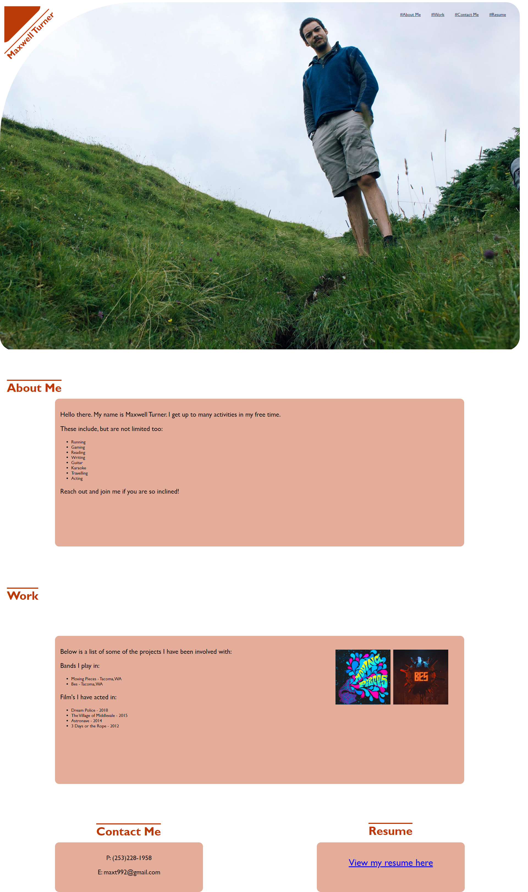

# My Portfolio Site


## Description

A rough template for a personal portfolio site built for myself.

## Things I Learned

- I learned alot about resizing and postition page content with absolute positioning.
- I learned how to create links contained within images.
- I learned about color schemes, and planning a page layout.
- Building triangles out of boxes
- Rotating elements
- Playing with box radii to create curved corners

I used HTML and CSS to accomplish this project.


## The Future of this Project

This site in its current form does not dynamically resize based on browser size. I think I overcomplicated things in the css. I plan on revisiting this weekly to refactor and improve page elements, as well as overall site beautification. 

Things I will add/improve:

- Dynamic element positioning based off container size
- Main image resizing (it currently takes up too much of the page.)
- Grouping elements closer together, and adjusting their sizes
- Rewriting section content, and properly formatting text
- Adding links to more of my projects
- Addng a working link to an updated resume


## Usage

Repo available at: 
```md
https://github.com/Maxt992/maxwell_portfolio
```

Copy the link below and paste it into your web browser. 

```md
https://maxt992.github.io/maxwell_portfolio/
```





## Credits

- UW Coding Bootcamp
- Anthony Brown